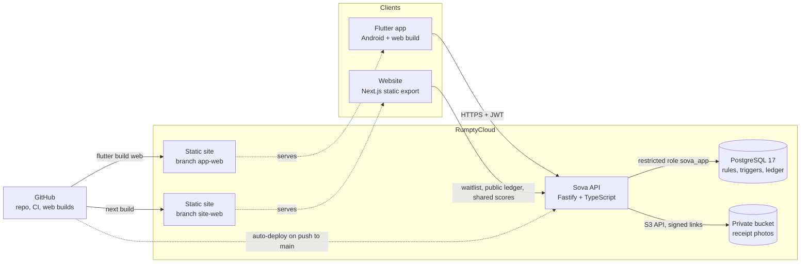

# Sova

Sova keeps the record for ajo, esusu and adashe savings circles: who joined, who collects when, who has paid and who has confirmed. It never holds, moves, lends or invests money. Members pay each other by bank transfer or cash as they always have; Sova keeps a tamper-evident record of it.

Built for Devcenter Hacktober 2026. First users are self-run circles of friends, colleagues and classmates.

## Try it

| What | Address |
|---|---|
| App (Flutter web build) | https://sova-app.rumptycloud.app (tap **Try the demo**) |
| Website | https://sova.rumptycloud.app |
| Verify a circle's record | https://sova.rumptycloud.app/verify/ |
| API health | https://sova-api.rumptycloud.app/health |

Every service runs on RumptyCloud's free size, which sleeps when idle: the first request after a quiet spell takes about 8 seconds while it wakes. The app waits for it.

The demo account's PIN is `2580` (the app shows it on every PIN sheet). [docs/demo-script.md](docs/demo-script.md) walks through the demo step by step.

## What it does

- **Circles.** Start a circle (amount, weekly or monthly, members, rules) and share a 6-character code; others join, accept the rules and may name a member who vouches for them.
- **Fair draw.** When the circle is full, the payout order is drawn by commit-reveal: Sova publishes the SHA-256 of a secret seed before anyone joins and reveals the seed at the draw, so anyone can recompute the order. The admin may pledge to collect last. See [docs/fair-draw.md](docs/fair-draw.md).
- **Paying and confirming.** Members mark "I sent it" (with a bank reference and an optional receipt photo); the turn's collector confirms each payment and then the payout. The payout is contribution × (members − 1). Money actions need a 4-digit PIN.
- **Shortfalls and disputes.** A short payout still advances the circle and opens a dispute against those who didn't pay. A payment can be disputed; the other members vote, and either side can settle.
- **Swaps and handovers.** Members can trade turns, or hand their place to someone else with the admin's approval.
- **Tamper-evident ledger.** Every change is written by database triggers into a per-circle SHA-256 hash chain that can't be edited or deleted. The website's verify page downloads a chain and rechecks every hash and the draw in the browser. See [docs/ledger.md](docs/ledger.md).
- **Sova Score.** A record of on-time payments, turns paid and circles finished, shown after 3 confirmed payments and shareable through a link. It is your record, not a credit rating.
- **Reminders.** In-app: payments due within 2 days or overdue, payments waiting for you to confirm, and recent events.

Roadmap, not built: push, SMS and WhatsApp reminders; voice prompts and local languages; offline use; USSD; collector (market) mode; publishing the ledger's chain head publicly. [docs/STATUS.md](docs/STATUS.md) lists exactly what is built.

## Architecture



- **The database holds the rules.** Joining, the draw, paying, confirming, closing a turn, disputes, swaps, handovers, the score and the ledger are PostgreSQL functions and triggers. They refuse with `SVxxx` errors that the API returns as `{ error: { code, message } }`. Whatever code writes, the rules still apply.
- **The API is a thin, checked wrapper.** Every input is validated with zod; every request is checked against circle membership and role (non-members get 404). It signs in by one-time code, issues 15-minute JWTs with rotating refresh tokens, and checks PINs (argon2id, 5 wrong tries lock for 15 minutes). In production it connects as `sova_app`, which can't change the schema or edit the ledger.
- **The app** talks only to the `SovaRepository` interface: `ApiRepository` in production, an in-memory `DemoRepository` with the same rules for tests and offline runs.
- **Public pages are static.** The website and the app's web build are plain files; their dynamic parts call the API.

## Repository

| Folder | What | README |
|---|---|---|
| `api/` | Fastify + TypeScript API, migration runner, seed | [api/README.md](api/README.md) |
| `app/` | Flutter app (Android + web), package `ng.sova.app` | [app/README.md](app/README.md) |
| `website/` | Next.js marketing site, `/verify` and `/score` pages | [website/README.md](website/README.md) |
| `db/migrations/` | Ordered SQL migrations | [db/README.md](db/README.md) |
| `docs/` | Status report, ledger and fair draw design, demo script | [docs/STATUS.md](docs/STATUS.md) |
| `DESIGN.md` | Design system: tokens, components, do's and don'ts | |

## Run it locally

You need Node.js 22, Flutter 3.44 (stable) and a PostgreSQL 17 database you can create tables in. The API's tests start their own throwaway PostgreSQL, so they need no database.

**1. API and database**

```bash
cd api
npm install
cp .env.example .env
```

In `api/.env`, set `DATABASE_URL` to your Postgres URL. The example file already allows the local app and website (`CORS_ORIGINS`), enables the demo login and adds a test phone number. Then:

```bash
npm run migrate
npm run seed
npm run dev
```

The API is at http://localhost:8080/health. `npm run seed` creates 18 demo people and 5 circles; it only ever touches the reserved phone range `+2348000000xxx`.

**2. App**

```bash
cd app
flutter pub get
flutter run -d chrome --web-port 3300 --dart-define=SOVA_API_URL=http://localhost:8080
```

Use `flutter run` on an Android phone or emulator instead of `-d chrome` (an emulator reaches your computer at `http://10.0.2.2:8080`). Without `SOVA_API_URL` the app runs on the in-memory demo backend, with the one-time code `123456` and PIN `2580`.

**3. Website**

```bash
cd website
npm install
cp .env.example .env.local
npm run dev
```

Point `NEXT_PUBLIC_API_URL` in `.env.local` at `http://localhost:8080` to use your local API. The site is at http://localhost:3000.

**Checks** (the same ones CI runs on every push and pull request):

| Folder | Commands |
|---|---|
| `api/` | `npm run typecheck`, `npm test`, `npm run build` |
| `app/` | `flutter analyze`, `flutter test` |
| `website/` | `npm run lint`, `npm run build` |

## Deploy on RumptyCloud

Sova runs as four RumptyCloud resources, all deployed from this GitHub repository through the RumptyCloud GitHub App.

**1. Database.** Create a managed PostgreSQL 17 database. From your computer, with the admin connection string in `api/.env` as `MIGRATION_DATABASE_URL`:

```bash
cd api
npm run db:create-app-role -- --out .env.deploy
npm run migrate
npm run seed
```

The first command creates the restricted `sova_app` login and writes its password to the git-ignored `.env.deploy` instead of the screen. Migrations always run from a computer: the API's build context doesn't contain `db/migrations`.

**2. Bucket.** Create a private S3-compatible bucket (`sova-receipts`) and an access key for it. Receipt photos stay off until the API has the `S3_*` variables.

**3. API.** New deployment from GitHub: branch `main`, root directory `api`, type Web Service/Backend, auto-deploy on push.

| Setting | Value |
|---|---|
| Build command | `npm ci && npm run build` |
| Start command | `export PATH="/mise/shims:$(echo /mise/installs/node/*/bin):$PATH"; exec node dist/server.js` |
| Health check path | `/health` |
| Port | `8080` |

The start command sets `PATH` itself because RumptyCloud runs it in a shell that can't see the image's Node install. Environment variables:

| Variable | Value |
|---|---|
| `NODE_ENV` | `production` |
| `DATABASE_URL` | the `sova_app` user on the database's **internal** host |
| `JWT_SECRET` | a long random string (at least 32 characters) |
| `CORS_ORIGINS` | `https://sova-app.rumptycloud.app,https://sova.rumptycloud.app` |
| `DEMO_LOGIN_ENABLED` | `true` |
| `OTP_PROVIDER`, `OTP_TEST_NUMBERS` | `test-numbers` and the phones allowed to sign in, with their fixed codes |
| `S3_ENDPOINT`, `S3_REGION`, `S3_BUCKET`, `S3_ACCESS_KEY_ID`, `S3_SECRET_ACCESS_KEY` | the bucket from step 2 |

`api/.env.example` describes every variable.

**4. App and website.** RumptyCloud's builder has no Flutter SDK, so GitHub Actions builds both front ends on every push to `main` that touches them and publishes the files to their own branches:

| Workflow | Builds | Publishes to |
|---|---|---|
| `.github/workflows/app-web.yml` | `flutter build web` with `SOVA_API_URL` and `SOVA_SITE_URL` | branch `app-web` |
| `.github/workflows/site-web.yml` | `next build` (static export) | branch `site-web` |

Create two RumptyCloud deployments of type Static Site/SPA, one serving branch `app-web` and one serving `site-web`, both with auto-deploy on push. The addresses the builds point at come from the repository variables `SOVA_API_URL`, `SITE_URL` and `APP_URL`, falling back to the live addresses above.

**Before judging.** Free deployments always sleep when idle. Paid sizes can turn scale-to-zero off; [docs/STATUS.md](docs/STATUS.md) tracks that decision.

## Security

- Secrets live only in environment variables; `.env` files are git-ignored and CI refuses committed database URLs with passwords.
- PINs are hashed with argon2id; one-time codes are stored as HMACs; refresh tokens rotate and a reused one revokes the whole session family.
- One-time code and PIN endpoints are rate-limited; logs redact PINs, codes, tokens and secrets.
- Receipt photos sit in a private bucket and are shown through 5-minute signed links; the API checks uploaded bytes really are an image.
- The ledger is tamper-evident, not tamper-proof: the database refuses edits and deletes for every role, and the hash chain shows any change made around it.

## Credits

Several website components are adapted from open-source libraries listed on [21st.dev](https://21st.dev): Aceternity UI (Timeline, Container Scroll Animation), Magic UI (Marquee, Animated Beam, Blur Fade), React Bits (Light Rays) and Orbiting Circles 02, restyled flat to Sova's palette.
